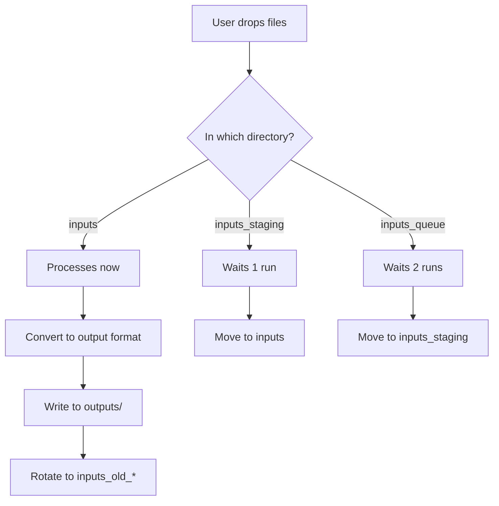

# Document Conversion Pipeline - User Guide

## Table of Contents

1. [Introduction](#introduction)
2. [Installation & Setup](#installation--setup)
3. [Understanding the System](#understanding-the-system)
4. [Basic Usage](#basic-usage)
5. [Advanced Configuration](#advanced-configuration)
6. [Workflow Examples](#workflow-examples)
7. [Best Practices](#best-practices)
8. [Troubleshooting](#troubleshooting)
9. [FAQ](#faq)
10. [Appendix](#appendix)

## Introduction

### What is this tool?

The Document Conversion Pipeline is an automated batch processing system for converting documents between formats (PDF, DOCX, Markdown, HTML, TXT) with intelligent file management, staging, and archiving capabilities.

### Who should use this?

- **AI Researchers**: Converting research papers and datasets to machine-readable formats
- **Documentation Teams**: Batch converting legacy documentation
- **Data Engineers**: Building document processing pipelines
- **Content Managers**: Migrating content between systems
- **Archivists**: Converting document archives with audit trails

### Key Benefits

1. **Zero Data Loss**: Automatic rotation preserves all processed files
2. **Collision Prevention**: Smart naming prevents file overwrites
3. **Audit Trail**: Timestamped reports for every conversion run
4. **Structure Preservation**: Maintains directory hierarchies
5. **Error Recovery**: Automatic retry with detailed error reporting

## Installation & Setup

### Prerequisites

**System Requirements**:
- Python 3.8 or higher
- 2GB RAM minimum (4GB recommended)
- 1GB free disk space per 100 documents

**Operating Systems**:
- macOS 10.15+
- Linux (Ubuntu 20.04+, CentOS 8+)
- Windows 10+ (with WSL recommended)

### Step 1: Install Python

#### macOS
```bash
# Using Homebrew
brew install python@3.12

# Or download from python.org
```

#### Linux
```bash
# Ubuntu/Debian
sudo apt update
sudo apt install python3.12 python3.12-pip

# CentOS/RHEL
sudo yum install python312
```

#### Windows
Download from [python.org](https://www.python.org/downloads/) or use WSL.

### Step 2: Install Dependencies

#### Option A: Using pip
```bash
pip install docling pyyaml
```

#### Option B: Using uv (Recommended)
```bash
# Install uv first
curl -LsSf https://astral.sh/uv/install.sh | sh

# Install dependencies
uv pip install docling pyyaml
```

#### Option C: Using requirements.txt
```bash
# Create requirements.txt
cat > requirements.txt << EOF
docling>=1.0.0
pyyaml>=6.0
EOF

# Install
pip install -r requirements.txt
```

### Step 3: Download the Script

```bash
# Clone repository
git clone https://github.com/yourusername/document-conversion-pipeline.git
cd document-conversion-pipeline

# Or download single file
curl -O https://raw.githubusercontent.com/yourusername/document-conversion-pipeline/main/docling-inputs2outputs.py
```

### Step 4: Initial Setup

```bash
# Generate default configuration
python docling-inputs2outputs.py --save-config

# Create directory structure
mkdir -p inputs inputs_queue inputs_staging outputs

# Verify installation
python docling-inputs2outputs.py --help
```

### Step 5: Test Installation

```bash
# Place a test PDF in inputs directory
cp sample.pdf inputs/

# Run dry-run mode
python docling-inputs2outputs.py --dry-run

# Expected output: "[DRY RUN] Would create: ./outputs/sample_from_pdf.md"
```

## Understanding the System

### Directory Structure Explained

```
project_root/
│
├── inputs_queue/          # Tier 3: Files for future processing
│   └── future_doc.pdf     # Will be processed in 2 runs
│
├── inputs_staging/        # Tier 2: Files for next run
│   └── next_doc.pdf       # Will be processed in next run
│
├── inputs/                # Tier 1: Active processing directory
│   └── current_doc.pdf    # Being processed now
│
├── inputs_old_TIMESTAMP/  # Archive: Completed processing
│   └── processed_doc.pdf  # Already converted
│
├── outputs/               # Results directory
│   ├── current_doc_from_pdf.md
│   ├── processed_doc_from_pdf.md
│   └── run_report_TIMESTAMP.txt
│
├── outputs_TIMESTAMP/     # Previous output snapshots
│   └── old_results.md
│
├── config.yaml            # Configuration file
└── docling-inputs2outputs.py  # Main script
```

### The Rotation Cycle

The system uses a three-tier rotation system:

**Before First Run**:
```
inputs_queue/    [file_C.pdf]
inputs_staging/  [file_B.pdf]
inputs/          [file_A.pdf]
outputs/         []
```

**During First Run**:
```
Processing: file_A.pdf → outputs/file_A_from_pdf.md
```

**After First Run (Rotation)**:
```
inputs_queue/    []              # Empty (moved to staging)
inputs_staging/  [file_C.pdf]    # From queue
inputs/          [file_B.pdf]    # From staging
inputs_old_XXX/  [file_A.pdf]    # Archived after processing
outputs/         [file_A_from_pdf.md]
```

**During Second Run**:
```
Processing: file_B.pdf → outputs/file_B_from_pdf.md
```

This cycle ensures:
- Files are processed in order
- Nothing is lost (archived in inputs_old_*)
- Clear separation between pending and processed files

### Conversion Flow



### File Naming Convention

To prevent collisions, files are renamed with source format:

**Input Files**:
```
report.pdf
report.docx
analysis.pdf
```

**Output Files** (converting to Markdown):
```
report_from_pdf.md      # From report.pdf
report_from_docx.md     # From report.docx
analysis_from_pdf.md    # From analysis.pdf
```

This ensures that even if you have `report.pdf` and `report.docx`, they don't overwrite each other when converted to the same format.

## Basic Usage

### Quick Start Workflow

#### Step 1: Place Files

```bash
# For immediate processing (this run)
cp my_document.pdf inputs/

# For next run
cp next_document.pdf inputs_staging/

# For run after next
cp future_document.pdf inputs_queue/
```

#### Step 2: Run Conversion

```bash
python docling-inputs2outputs.py
```

#### Step 3: Check Results

```bash
# View converted files
ls outputs/

# Read the run report
cat outputs/run_report_*.txt

# Check archived originals
ls inputs_old_*/
```

### Common Commands

#### Preview Without Converting
```bash
python docling-inputs2outputs.py --dry-run
```

#### Enable Verbose Output
```bash
python docling-inputs2outputs.py --log-level DEBUG
```

#### Use Custom Configuration
```bash
python docling-inputs2outputs.py --config my_config.yaml
```

#### Override Directories
```bash
python docling-inputs2outputs.py \
  --inputs /path/to/inputs \
  --outputs /path/to/outputs
```

#### Generate Default Config
```bash
python docling-inputs2outputs.py --save-config
```

### Understanding Output

#### Console Output

```
======================================================================
DOCUMENT CONVERSION PIPELINE
======================================================================
Start time: 2025-09-30 16:10:16

Loaded configuration from config.yaml
Previous outputs preserved at: ./outputs_20250930_161016_102

======================================================================
DISCOVERY PHASE: Scanning for input files
======================================================================
Found 2 input files with allowed types
Input types: ['pdf']
Output types: ['md']
Recursive processing: ENABLED

======================================================================
CONVERSION PHASE: Processing documents
======================================================================
[1/2 - 50.0%] Processing: document1.pdf
  Converting to md: document1_from_pdf.md
  ✓ Success: ./outputs/document1_from_pdf.md

[2/2 - 100.0%] Processing: document2.pdf
  Converting to md: document2_from_pdf.md
  ✓ Success: ./outputs/document2_from_pdf.md

======================================================================
ROTATION PHASE: Post-conversion input rotation
======================================================================
✓ Rotated processed files: ./inputs -> ./inputs_old_20250930_161031
✓ Created empty: ./inputs
No items in ./inputs_staging
No items in ./inputs_queue

======================================================================
CONVERSION STATISTICS
======================================================================
Total files discovered: 2
Successful conversions: 2
Failed conversions: 0
Skipped (same type): 0
Total data processed: 5.7MB
Total runtime: 15.0s
======================================================================
```

#### Run Report Contents

Each run generates a detailed report:

```
Document Conversion Run Report
Generated: 2025-09-30 16:10:31

Configuration:
  Input types: ['pdf']
  Output types: ['md']
  Max file size: 100MB
  Inputs directory: ./inputs
  Outputs directory: ./outputs
  Retry attempts: 2

Files discovered: 2

SUCCESS: document1.pdf -> ./outputs/document1_from_pdf.md
SUCCESS: document2.pdf -> ./outputs/document2_from_pdf.md

======================================================================
CONVERSION STATISTICS
======================================================================
Total files discovered: 2
Successful conversions: 2
Failed conversions: 0
Skipped (same type): 0
Total data processed: 5.7MB
Total runtime: 15.0s
======================================================================
```

## Advanced Configuration

### Configuration File Structure

The `config.yaml` file controls all aspects of the conversion:

```yaml
# Input file types to process
input_types:
  - pdf      # Process PDF files
  - docx     # Process Word documents
  - txt      # Process plain text
  - html     # Process HTML files

# Output formats to generate
output_types:
  - md       # Generate Markdown
  - html     # Generate HTML
  - txt      # Generate plain text

# File size limit (in megabytes)
max_file_size_mb: 100

# Retry configuration for failed conversions
retry_attempts: 2
retry_delay_seconds: 1.0

# Directory paths (relative or absolute)
directories:
  inputs: ./inputs
  outputs: ./outputs
  inputs_queue: ./inputs_queue
  inputs_staging: ./inputs_staging
```

### Configuration Options Detailed

#### input_types

Supported formats:
- `pdf` - Portable Document Format
- `docx` - Microsoft Word documents
- `txt` - Plain text files
- `md` - Markdown files
- `html` - HTML documents

**Example**: Process only PDFs
```yaml
input_types:
  - pdf
```

**Example**: Process multiple types
```yaml
input_types:
  - pdf
  - docx
  - html
```

#### output_types

Same format options as input_types.

**Example**: Generate both Markdown and HTML
```yaml
output_types:
  - md
  - html
```

**Note**: The system automatically skips conversions where input and output types are the same (e.g., PDF to PDF).

#### max_file_size_mb

Prevents processing of files larger than specified size.

**Recommended Values**:
- Small systems (2GB RAM): 50MB
- Medium systems (4GB RAM): 100MB
- Large systems (8GB+ RAM): 200MB

**Example**:
```yaml
max_file_size_mb: 150
```

Files exceeding this limit are:
- Skipped with warning
- Logged in run report
- Not moved to archives (remain in inputs)

#### retry_attempts

Number of additional attempts after initial failure.

**Values**:
- `0`: No retries (fail immediately)
- `1`: Retry once (2 total attempts)
- `2`: Retry twice (3 total attempts, recommended)
- `3+`: Multiple retries (for unstable connections)

**Example**:
```yaml
retry_attempts: 3
retry_delay_seconds: 2.0
```

#### directories

Customize all directory paths.

**Relative Paths** (default):
```yaml
directories:
  inputs: ./inputs
  outputs: ./outputs
  inputs_queue: ./inputs_queue
  inputs_staging: ./inputs_staging
```

**Absolute Paths**:
```yaml
directories:
  inputs: /data/conversion/inputs
  outputs: /data/conversion/outputs
  inputs_queue: /data/conversion/queue
  inputs_staging: /data/conversion/staging
```

**Mixed Paths**:
```yaml
directories:
  inputs: ./inputs
  outputs: /mnt/shared/outputs  # Network drive
  inputs_queue: ./queue
  inputs_staging: ./staging
```

### CLI Overrides

Command-line arguments override config.yaml:

```bash
# Override directories
python docling-inputs2outputs.py \
  --inputs /custom/inputs \
  --outputs /custom/outputs

# Use custom config file
python docling-inputs2outputs.py --config production.yaml

# Change log level
python docling-inputs2outputs.py --log-level DEBUG

# Combine multiple overrides
python docling-inputs2outputs.py \
  --config staging.yaml \
  --inputs ./test_inputs \
  --log-level DEBUG \
  --dry-run
```

### Environment-Specific Configurations

#### Development Config

```yaml
# config.dev.yaml
input_types: [pdf]
output_types: [md]
max_file_size_mb: 10  # Small limit for testing
retry_attempts: 1
directories:
  inputs: ./dev_inputs
  outputs: ./dev_outputs
  inputs_queue: ./dev_queue
  inputs_staging: ./dev_staging
```

Usage:
```bash
python docling-inputs2outputs.py --config config.dev.yaml
```

#### Production Config

```yaml
# config.prod.yaml
input_types: [pdf, docx, html]
output_types: [md, html]
max_file_size_mb: 200
retry_attempts: 3
retry_delay_seconds: 2.0
directories:
  inputs: /data/prod/inputs
  outputs: /data/prod/outputs
  inputs_queue: /data/prod/queue
  inputs_staging: /data/prod/staging
```

Usage:
```bash
python docling-inputs2outputs.py --config config.prod.yaml
```

## Workflow Examples

### Example 1: Research Paper Processing

**Scenario**: Convert 100 PDF research papers to Markdown for LLM training.

**Setup**:
```bash
# 1. Configure for PDF to Markdown
cat > config.yaml << EOF
input_types: [pdf]
output_types: [md]
max_file_size_mb: 50
retry_attempts: 2
directories:
  inputs: ./inputs
  outputs: ./outputs
  inputs_queue: ./inputs_queue
  inputs_staging: ./inputs_staging
EOF

# 2. Organize papers
mkdir -p inputs_queue
cp papers/*.pdf inputs_queue/

# 3. Process in batches of ~20
# First run: Move 20 to staging
mv inputs_queue/paper_001.pdf inputs_staging/
mv inputs_queue/paper_002.pdf inputs_staging/
# ... (repeat for 20 files)

# 4. Run conversion
python docling-inputs2outputs.py

# 5. Repeat for remaining papers
```

### Example 2: Documentation Migration

**Scenario**: Migrate company documentation from DOCX to HTML.

**Directory Structure**:
```
docs/
├── user_guides/
│   ├── getting_started.docx
│   └── advanced.docx
├── api/
│   ├── reference.docx
│   └── examples.docx
└── tutorials/
    └── quickstart.docx
```

**Steps**:
```bash
# 1. Configure for DOCX to HTML
cat > config.yaml << EOF
input_types: [docx]
output_types: [html]
max_file_size_mb: 100
directories:
  inputs: ./docs_input
  outputs: ./docs_output
  inputs_queue: ./docs_queue
  inputs_staging: ./docs_staging
EOF

# 2. Copy entire directory structure to inputs
cp -r docs/* inputs/

# 3. Run conversion (preserves directory structure)
python docling-inputs2outputs.py

# 4. Verify output structure
tree outputs/
# outputs/
# ├── user_guides/
# │   ├── getting_started_from_docx.html
# │   └── advanced_from_docx.html
# ├── api/
# │   ├── reference_from_docx.html
# │   └── examples_from_docx.html
# └── tutorials/
#     └── quickstart_from_docx.html
```

### Example 3: Automated Pipeline

**Scenario**: Watchdog service that processes documents as they arrive.

**Script** (`watch_and_convert.sh`):
```bash
#!/bin/bash
# watch_and_convert.sh

WATCH_DIR="/incoming/documents"
QUEUE_DIR="./inputs_queue"

# Monitor directory for new files
inotifywait -m -e close_write --format '%w%f' "$WATCH_DIR" | while read NEW_FILE
do
    echo "New file detected: $NEW_FILE"
    
    # Copy to queue
    cp "$NEW_FILE" "$QUEUE_DIR/"
    
    # Run conversion
    python docling-inputs2outputs.py
    
    # Send notification
    echo "Processed: $NEW_FILE" | mail -s "Conversion Complete" admin@example.com
done
```

**Cron Job** (runs every hour):
```bash
# crontab -e
0 * * * * cd /path/to/project && python docling-inputs2outputs.py >> /var/log/docling.log 2>&1
```

### Example 4: Multi-Format Export

**Scenario**: Convert PDFs to both Markdown and HTML.

**Config**:
```yaml
input_types: [pdf]
output_types: [md, html]  # Generate both formats
max_file_size_mb: 100
```

**Result**:
```bash
# Input
inputs/report.pdf

# Output
outputs/
├── report_from_pdf.md
└── report_from_pdf.html
```

### Example 5: Batch with Error Handling

**Scenario**: Process 1000 documents with proper error tracking.

**Script** (`batch_process.sh`):
```bash
#!/bin/bash

LOG_FILE="batch_process.log"
ERROR_FILE="batch_errors.log"

# Split files into batches of 50
find inputs_queue/ -name "*.pdf" | split -l 50 - batch_

for BATCH in batch_*; do
    echo "Processing batch: $BATCH" | tee -a "$LOG_FILE"
    
    # Move batch to staging
    while IFS= read -r file; do
        mv "$file" inputs_staging/
    done < "$BATCH"
    
    # Run conversion
    if python docling-inputs2outputs.py --log-level INFO 2>&1 | tee -a "$LOG_FILE"; then
        echo "Batch $BATCH completed successfully" | tee -a "$LOG_FILE"
    else
        echo "Batch $BATCH failed" | tee -a "$ERROR_FILE"
    fi
    
    # Clean up batch file
    rm "$BATCH"
    
    # Wait between batches
    sleep 5
done

echo "Batch processing complete. Check $ERROR_FILE for failures."
```

## Best Practices

### File Organization

1. **Use Descriptive Names**
   ```bash
   # Good
   2024_annual_report.pdf
   user_guide_v2.3.pdf
   
   # Avoid
   doc1.pdf
   temp.pdf
   ```

2. **Maintain Directory Structure**
   ```
   inputs/
   ├── 2024/
   │   ├── Q1/
   │   └── Q2/
   └── 2025/
       └── Q1/
   ```

3. **Use Consistent Naming Conventions**
   ```bash
   # Date prefix for chronological sorting
   20250930_report.pdf
   20250929_analysis.pdf
   ```

### Performance Optimization

1. **Batch Size**
   - Process 20-50 files per run for optimal performance
   - Monitor memory usage with large PDFs

2. **File Size Limits**
   ```yaml
   # Set based on available RAM
   max_file_size_mb: 100  # 4GB RAM system
   max_file_size_mb: 200  # 8GB RAM system
   ```

3. **Disk Space**
   - Each run creates archives (inputs_old_*)
   - Plan for 2-3x input file size for outputs
   - Regularly clean old archives

4. **Cleanup Strategy**
   ```bash
   # Keep only last 7 days of archives
   find . -name "inputs_old_*" -mtime +7 -exec rm -rf {} +
   find . -name "outputs_*" -mtime +7 -exec rm -rf {} +
   ```

### Error Prevention

1. **Pre-Flight Checks**
   ```bash
   # Always dry-run first
   python docling-inputs2outputs.py --dry-run
   
   # Check disk space
   df -h .
   
   # Verify file permissions
   ls -la inputs/
   ```

2. **Validate PDFs**
   ```bash
   # Check PDF integrity before processing
   for pdf in inputs/*.pdf; do
       pdfinfo "$pdf" || echo "Corrupt: $pdf"
   done
   ```

3. **Monitor Logs**
   ```bash
   # Save logs for review
   python docling-inputs2outputs.py 2>&1 | tee conversion.log
   
   # Check for errors
   grep -i "error\|failed" conversion.log
   ```

### Data Safety

1. **Backup Strategy**
   ```bash
   # Before large batch
   tar -czf backup_$(date +%Y%m%d).tar.gz inputs/ outputs/ config.yaml
   ```

2. **Archive Management**
   ```bash
   # Compress old archives
   for dir in inputs_old_*; do
       tar -czf "${dir}.tar.gz" "$dir" && rm -rf "$dir"
   done
   ```

3. **Output Verification**
   ```bash
   # Verify outputs were created
   python << EOF
   import os
   inputs = len([f for f in os.listdir('inputs_old_20250930_161031') if f.endswith('.pdf')])
   outputs = len([f for f in os.listdir('outputs') if f.endswith('.md')])
   print(f"Inputs: {inputs}, Outputs: {outputs}, Match: {inputs == outputs}")
   EOF
   ```

## Troubleshooting

### Common Issues

#### Issue: "No files found to process"

**Symptoms**:
```
Found 0 input files with allowed types
```

**Causes & Solutions**:

1. **Wrong directory**
   ```bash
   # Check current directory
   pwd
   
   # Verify files are in inputs/
   ls -la inputs/
   ```

2. **Wrong file extension**
   ```bash
   # Check config
   grep "input_types" config.yaml
   
   # Verify file extensions
   ls inputs/ | cut -d. -f2 | sort -u
   ```

3. **Files in wrong directory**
   ```bash
   # Check if files are in queue/staging
   ls inputs_queue/
   ls inputs_staging/
   
   # Move to inputs if needed
   mv inputs_queue/* inputs/
   ```

#### Issue: "File size exceeds limit"

**Symptoms**:
```
Skipping file.pdf: File size 150.2MB exceeds limit of 100MB
```

**Solutions**:

1. **Increase limit** (if you have RAM):
   ```yaml
   max_file_size_mb: 200
   ```

2. **Split large PDF**:
   ```bash
   # Using pdftk
   pdftk large.pdf burst output page_%04d.pdf
   ```

3. **Process separately**:
   ```bash
   # Temporarily increase limit for one file
   python docling-inputs2outputs.py --config unlimited.yaml
   ```

#### Issue: "Conversion failed" with retry

**Symptoms**:
```
Error converting file.pdf to md
Retry attempt 1/2 for file.pdf
```

**Causes & Solutions**:

1. **Corrupted PDF**
   ```bash
   # Verify PDF
   pdfinfo file.pdf
   
   # Repair if possible
   pdftk file.pdf output file_repaired.pdf
   ```

2. **Unsupported PDF features**
   ```bash
   # Check PDF version
   pdfinfo file.pdf | grep "PDF version"
   
   # Convert to compatible version
   gs -sDEVICE=pdfwrite -dCompatibilityLevel=1.4 \
      -o output.pdf input.pdf
   ```

3. **Memory issues**
   ```bash
   # Check system memory
   free -h
   
   # Process fewer files at once
   ```

#### Issue: Path-related errors

**Symptoms**:
```
ValueError: 'file.pdf' is not in the subpath of '/full/path/inputs'
```

**Solutions**:

1. **Run from project root**:
   ```bash
   cd /path/to/project
   python docling-inputs2outputs.py
   ```

2. **Use absolute paths**:
   ```yaml
   directories:
     inputs: /full/path/to/inputs
   ```

#### Issue: Import errors

**Symptoms**:
```
ERROR: docling package not found
```

**Solutions**:

1. **Install docling**:
   ```bash
   pip install docling
   ```

2. **Check Python environment**:
   ```bash
   which python
   pip list | grep docling
   ```

3. **Use correct virtual environment**:
   ```bash
   source venv/bin/activate
   pip install docling
   ```

### Debug Mode

Enable detailed logging:

```bash
# Maximum verbosity
python docling-inputs2outputs.py --log-level DEBUG 2>&1 | tee debug.log

# Check what's happening
tail -f debug.log
```

### Getting Help

1. **Check run report**:
   ```bash
   cat outputs/run_report_*.txt
   ```

2. **Review logs**:
   ```bash
   grep -i "error\|warning\|failed" conversion.log
   ```

3. **Dry run to diagnose**:
   ```bash
   python docling-inputs2outputs.py --dry-run --log-level DEBUG
   ```

## FAQ

### General Questions

**Q: Can I process files from multiple input directories?**

A: No, but you can symlink or copy files into inputs/:
```bash
ln -s /path/to/docs/* inputs/
```

**Q: How do I convert only specific files?**

A: Place only those files in inputs/, or use file extension filtering in config.yaml.

**Q: Can I run multiple conversions simultaneously?**

A: No, the script is designed for sequential processing. Use separate project directories for parallel runs.

**Q: How much disk space do I need?**

A: Plan for:
- Input files: X GB
- Output files: ~1.5X GB (depending on format)
- Archives: X GB
- Total: ~3.5X GB

### Configuration Questions

**Q: Can I convert PDF to multiple formats in one run?**

A: Yes:
```yaml
input_types: [pdf]
output_types: [md, html, txt]
```

**Q: How do I disable automatic rotation?**

A: The rotation is core to the design and cannot be disabled. Use a simple one-time conversion script if rotation isn't needed.

**Q: Can I customize output filenames?**

A: Currently, filenames follow the pattern `{input_name}_from_{input_ext}.{output_ext}`. Customization requires code modification.

### Technical Questions

**Q: Why does it create `inputs_old_*` directories?**

A: To preserve processed files as backups. You can safely delete old ones after confirming outputs are correct.

**Q: Why are logs duplicated?**

A: Known cosmetic issue with logging. Doesn't affect functionality. Will be fixed in future version.

**Q: Can I modify the conversion process?**

A: Yes, the script is open source. See TECHNICAL_DOCS.md for architecture details.

**Q: What happens if the script crashes mid-conversion?**

A: 
- Completed conversions are saved (atomic writes)
- Incomplete files can be retried on next run
- Run report shows what succeeded/failed

## Appendix

### A. Supported File Formats

| Format | Extension | Input | Output | Notes |
|--------|-----------|-------|--------|-------|
| PDF | .pdf | ✓ | ✓ | Most tested format |
| Word | .docx | ✓ | ✓ | Requires python-docx |
| Text | .txt | ✓ | ✓ | Plain text |
| Markdown | .md | ✓ | ✓ | GitHub-flavored |
| HTML | .html | ✓ | ✓ | Full HTML support |

### B. Directory Reference

| Directory | Purpose | Created By | Persistence |
|-----------|---------|------------|-------------|
| `inputs/` | Active processing | Script | Recreated each run |
| `inputs_queue/` | Future processing | User | Permanent |
| `inputs_staging/` | Next run processing | User/Script | Permanent |
| `inputs_old_*/` | Processed archives | Script | Manual cleanup |
| `outputs/` | Conversion results | Script | Permanent |
| `outputs_*/` | Output snapshots | Script | Manual cleanup |

### C. Configuration Reference

Complete configuration options:

```yaml
# File type filters
input_types: [pdf, docx, txt, md, html]
output_types: [pdf, docx, txt, md, html]

# Processing limits
max_file_size_mb: 100
retry_attempts: 2
retry_delay_seconds: 1.0

# Paths (relative or absolute)
directories:
  inputs: ./inputs
  outputs: ./outputs
  inputs_queue: ./inputs_queue
  inputs_staging: ./inputs_staging
```

### D. CLI Options Reference

```
usage: docling-inputs2outputs.py [-h] [--config CONFIG] [--save-config]
                                  [--dry-run] [--log-level LOG_LEVEL]
                                  [--inputs INPUTS] [--outputs OUTPUTS]
                                  [--inputs-queue INPUTS_QUEUE]
                                  [--inputs-staging INPUTS_STAGING]

options:
  -h, --help            Show help message
  --config CONFIG       Path to YAML config (default: config.yaml)
  --save-config         Generate default config and exit
  --dry-run             Preview without converting
  --log-level LEVEL     DEBUG, INFO, WARNING, ERROR
  --inputs PATH         Override inputs directory
  --outputs PATH        Override outputs directory
  --inputs-queue PATH   Override queue directory
  --inputs-staging PATH Override staging directory
```

### E. Exit Codes

| Code | Meaning |
|------|---------|
| 0 | Success (all files converted) |
| 1 | Failure (config error, fatal error, or failed conversions) |

### F. Glossary

- **Rotation**: Moving files between directories after processing
- **Staging**: Temporary holding area for files awaiting processing
- **Archive**: Historical copies of processed files (inputs_old_*)
- **Snapshot**: Copy of outputs before new run
- **Collision**: When two files would create same output filename
- **Atomic Write**: Write operation that completes fully or not at all
- **Dry Run**: Preview mode that shows what would happen without executing

### G. Performance Benchmarks

Tested on MacBook Pro M1 (16GB RAM):

| File Count | Avg Size | Total Size | Runtime | Throughput |
|------------|----------|------------|---------|------------|
| 10 | 2MB | 20MB | 45s | 0.44 MB/s |
| 50 | 2MB | 100MB | 3m 45s | 0.44 MB/s |
| 100 | 2MB | 200MB | 7m 30s | 0.44 MB/s |
| 10 | 10MB | 100MB | 5m 30s | 0.30 MB/s |

*Note: Performance varies by PDF complexity, system specs, and format*